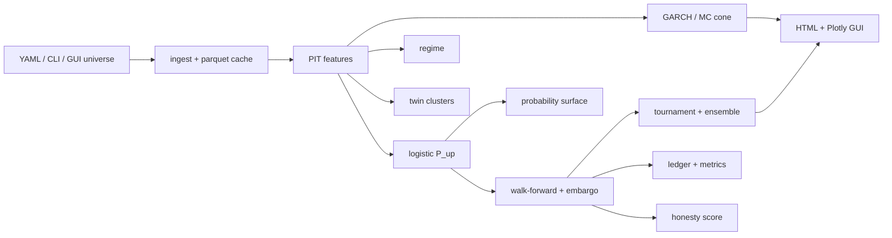

# Stock Probability Engine (SPE)

[](https://www.python.org/)
[](LICENSE)
[](#)
[](https://colab.research.google.com/)

> **Calibrated multi-horizon equity probabilities + honest prediction cones.**  
> Not a price oracle. Not a trading bot. A **probability laboratory** you can audit.

**Disclaimer:** Research only — see [CODE_OF_ETHICS.md](CODE_OF_ETHICS.md). Not financial advice.

---

## Table of contents

1. [Why this exists](#why-this-exists)
2. [Colab quickstart (recommended)](#colab-quickstart-recommended)
3. [Tutorial: first run in 10 minutes](#tutorial-first-run-in-10-minutes)
4. [Local / CLI quickstart](#local--cli-quickstart)
5. [What you get (visuals & files)](#what-you-get-visuals--files)
6. [Architecture](#architecture)
7. [Dynamic tickers](#dynamic-tickers-design-rule)
8. [TradingView (optional)](#tradingview-optional)
9. [Method](#method-short)
10. [Project layout](#project-layout)
11. [Tests](#tests)

---

## Why this exists

Retail “stock predictors” often overfit noise and hide uncertainty. SPE does the opposite:

1. **Dynamic universe** — tickers are **config/CLI data**, never hardcoded in core algorithms  
2. **Triangulation features** — rolling beta/corr to domestic + US index + one macro  
3. **`P(up)` + fan-chart cones** — multi-horizon (5d / 21d / 252d)  
4. **Walk-forward OOS** with embargo scoring vs **base rate** & **momentum**  
5. **Full lab modules** — GARCH cones, regime, IDX spillover, tournament/ensemble, twins, honesty score, probability surface  
6. **Everything recorded** — `runs/{run_id}/`, append-only ledger, HTML reports  
7. **Colab GUI** — interactive widgets + Plotly **inside the notebook** (no website to host)

---

## Colab quickstart (recommended)

You need: a Google account + [Google Colab](https://colab.research.google.com/).

### Option A — Clone repo in Colab (fastest first try)

Open a **new Colab notebook** and run:

```python
# 1) Clone
!git clone https://github.com/SeraKah-1/stock-probability-engine.git
%cd stock-probability-engine

# 2) Install deps (CPU is enough)
%pip install -q -r requirements.txt

# 3) Import path + Plotly for Colab
import sys
sys.path.insert(0, "src")
import plotly.io as pio
pio.renderers.default = "colab"

# 4) Launch interactive GUI (forms + charts in the cell output)
from stock_prob.ui_colab import launch_gui
launch_gui(default_equity="BBCA.JK")
```

Then:

1. Edit **Equity** (e.g. `BBCA.JK`, `TLKM.JK`, `AAPL`)  
2. Set **Dom index** / **US index** / **Macro** (defaults work for IDX/US)  
3. Pick **Horizons**  
4. Click **▶ Run analysis**  
5. Scroll down for **P(up) table**, **metrics**, and **fan chart**

### Option B — Project on Google Drive (persistent cache)

Good if you re-run often (parquet cache + `runs/` survive runtime resets).

```python
from google.colab import drive
drive.mount("/content/drive")

# First time only: clone into Drive
!git clone https://github.com/SeraKah-1/stock-probability-engine.git /content/drive/MyDrive/stock-prob

import sys
from pathlib import Path
ROOT = Path("/content/drive/MyDrive/stock-prob")
sys.path.insert(0, str(ROOT / "src"))

%pip install -q -r {ROOT}/requirements.txt

import plotly.io as pio
pio.renderers.default = "colab"

from stock_prob.ui_colab import launch_gui
launch_gui(default_equity="BBCA.JK")
```

On later sessions: skip `git clone`, just `drive.mount` + `sys.path` + `launch_gui()`.

### Option C — Notebook file already in the repo

1. Upload / open [`notebooks/01_lab_gui.ipynb`](notebooks/01_lab_gui.ipynb) in Colab  
2. Runtime → **Run all**  
3. Use the GUI cell  

---

## Tutorial: first run in 10 minutes

### Step 1 — Decide market

| You want… | Equity example | Dom index | US index | Macro |
|-----------|----------------|-----------|----------|--------|
| Indonesia (IDX) | `BBCA.JK` | `^JKSE` | `^GSPC` | `^VIX` |
| United States | `AAPL` | `^GSPC` | `^GSPC` | `^VIX` |

Use the **Preset IDX** / **Preset US** buttons in the GUI, or type freely.

### Step 2 — Run one ticker (GUI)

```python
from stock_prob.ui_colab import launch_gui
launch_gui(default_equity="BBCA.JK")
```

Click **Run analysis**. First fetch may take ~10–30s; next runs use cache.

### Step 3 — Read the outputs

| Block | How to read it |
|-------|----------------|
| **P(up)** | Probability price is higher after the horizon (not a guarantee) |
| **Brier model vs base / momentum** | **Lower is better.** If model Brier ≈ base rate, you are not beating a dumb baseline |
| **Fan chart** | Median path + uncertainty cone (bands widen with horizon) |
| **Regime** | `CALM` / `ELEVATED` / `PANIC` — cone may widen in panic |
| **run_id / report path** | Folder under `runs/` with HTML + CSV/parquet for audit |

### Step 4 — One-shot API (no buttons)

Useful in scripted cells:

```python
from stock_prob.ui_colab import run_once, render_result

res = run_once(
    "AAPL",
    domestic_index="^GSPC",
    us_index="^GSPC",
    macro="^VIX",
    horizons=[5, 21, 252],
    use_lab=True,   # GARCH + regime + tournament + honesty
)
render_result(res)

print("HTML report:", res.get("lab_report") or res.get("report_html"))
print("Artifacts:", res.get("art_dir"))
```

### Step 5 — Change ticker anytime

Just change the string — **no code edits in the library**:

```python
run_once("TLKM.JK", domestic_index="^JKSE", us_index="^GSPC", macro="^VIX")
run_once("MSFT", domestic_index="^GSPC", us_index="^GSPC", macro="^VIX")
```

### Step 6 — (Optional) Terminal UI in Colab

Colab menu → **Runtime** might expose a terminal, or use a code cell:

```bash
!cd /content/stock-probability-engine && PYTHONPATH=src python scripts/tui_lab.py
```

### Step 7 — (Optional) Multi-ticker panel lab

```bash
!cd /content/stock-probability-engine && PYTHONPATH=src python scripts/run_full_lab.py --config configs/panel_core.yaml
```

Open the printed `index.html` path (or from Drive under `runs/full_lab_*/index.html`).

### Step 8 — Sanity checklist

- [ ] Live `P(up)` exists for **every** horizon you selected (not NaN)  
- [ ] Metrics table includes **brier_model** and **brier_base**  
- [ ] Fan chart shows a **band**, not a single future line  
- [ ] You compared model vs base rate before trusting any number  

More detail: [docs/USAGE_AND_VIZ.md](docs/USAGE_AND_VIZ.md).

---

## Local / CLI quickstart

```bash
git clone https://github.com/SeraKah-1/stock-probability-engine.git
cd stock-probability-engine
python -m venv .venv && source .venv/bin/activate   # optional
pip install -r requirements.txt
export PYTHONPATH=$PWD/src

# Single ticker (config file)
python scripts/run_demo.py --config configs/universe_idx_example.yaml

# Fully dynamic CLI — change tickers anytime
python scripts/run_demo.py \
  --equities TLKM.JK \
  --domestic-index '^JKSE' \
  --us-index '^GSPC' \
  --macro '^VIX' \
  --equity TLKM.JK \
  --horizons 5,21,252

# Full multi-ticker lab
python scripts/run_full_lab.py --config configs/panel_core.yaml

# Terminal UI
python scripts/tui_lab.py
```

---

## What you get (visuals & files)

| Path | Content |
|------|---------|
| Notebook GUI | Plotly fan chart + tables in cell output |
| `runs/{run_id}/report.html` | Fan chart + metrics (open/download file) |
| `runs/{run_id}/report_lab.html` | GARCH cone + regime + tournament |
| `runs/{lab_id}/index.html` | Panel + country skill + twins |
| `predictions/ledger.parquet` | Append-only prediction journal |
| `exports/gallery/` | HTML copies |

When Google Drive is mounted and the project lives under  
`/content/drive/MyDrive/stock-prob`, that path is preferred as the data lake.

**No web server required** — GUI is notebook widgets; reports are static HTML files.

---

## Architecture



---

## Dynamic tickers (design rule)

Core modules (`features`, `models`, `backtest`, `labels`, `scoring`) **contain no pilot symbols**.

Universe is always supplied as data:

```yaml
# configs/universe_idx_example.yaml
universe:
  equities: [BBCA.JK]      # change freely
  domestic_index: "^JKSE"
  us_index: "^GSPC"
  macro: "^VIX"
```

---

## TradingView (optional)

Pine Script **proxies** (not the Python model) live in [`tradingview/`](tradingview/):

| File | Role |
|------|------|
| `SPE_Triangulation.pine` | β / ρ vs domestic + US index |
| `SPE_Regime_ProbProxy.pine` | Regime + 0–100 score proxy |
| `SPE_Cone_Bands.pine` | Forward vol bands on price |

Install: TradingView → Pine Editor → paste → **Add to chart**.  
See [tradingview/README.md](tradingview/README.md).

---

## Method (short)

| Step | What |
|------|------|
| Features | Log returns, rolling β/ρ to indexes, vol, momentum, macro Δ |
| Direction | Logistic regression → `P(up)` per horizon |
| Cone | Monte Carlo paths; lab path uses **GARCH(1,1)** vol + regime width |
| Validation | Expanding walk-forward; score on embargo grid |
| Baselines | Base rate, momentum — always on the board |
| Lab extras | IDX overnight spillover, model tournament, form-based twins, honesty skill |

**Metrics:** Brier (primary), hit rate (secondary), cone coverage @80%, sharpness, honesty skill.

---

## Project layout

```
src/stock_prob/          # library
  ui_colab.py            # launch_gui / launch_tui / run_once
  pipeline.py lab.py garch.py regime.py ...
configs/                 # example universes (data, not code)
notebooks/
  01_lab_gui.ipynb       # Colab GUI entry
scripts/
  run_demo.py
  run_full_lab.py
  tui_lab.py
tradingview/             # Pine Script proxies
docs/
  USAGE_AND_VIZ.md
tests/
```

---

## Tests

```bash
PYTHONPATH=src pytest tests/ -v
```

Covers: dynamic two-universe path, no look-ahead labels, embargo, finite live `P(up)` for all horizons, GARCH/regime/tournament/twins/honesty.

---

## Roadmap status

| Wave | Scope | Status |
|------|--------|--------|
| 0–3 | Dynamic core, WF, reports, ledger | **Done** |
| 4 | GARCH, regime, spillover, tournament | **Done** |
| 5 | Multi-ticker panel, IDX vs US skill | **Done** |
| 6 | Twins, honesty, probability surface | **Done** |
| 7 | OSS packaging + GitHub + Colab GUI | **Done** |

---

## Citation

If this helps a portfolio or paper:

```
Stock Probability Engine (SPE) — multi-horizon equity probability lab.
https://github.com/SeraKah-1/stock-probability-engine
```

---

## License

MIT — see [LICENSE](LICENSE).
