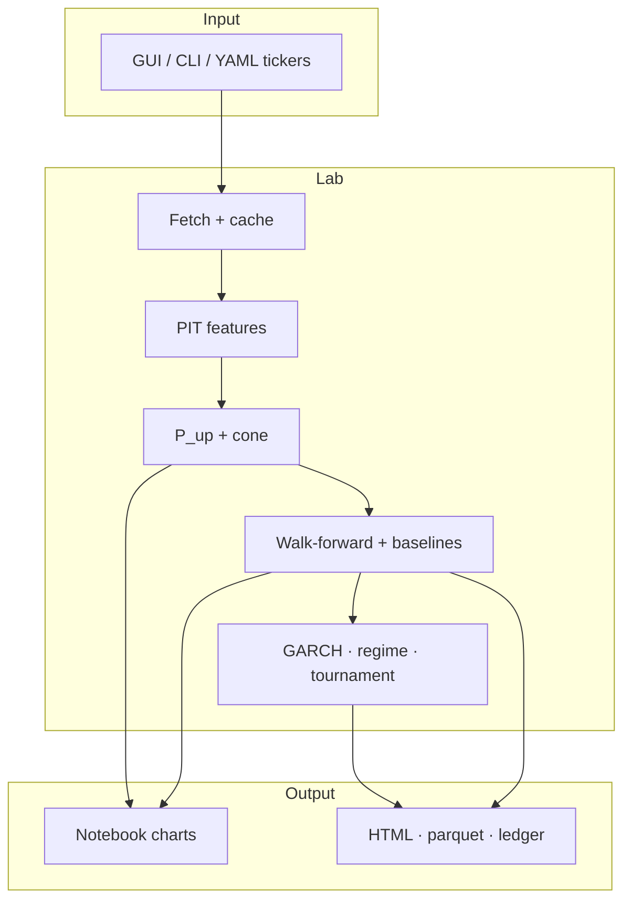

# Prism

**Honest equity probabilities. Fan-chart cones. No fake price lines.**

[](https://www.python.org/)
[](https://colab.research.google.com/)
[](LICENSE)
[](https://github.com/SeraKah-1/prism/releases)

<p align="center">
  <em>Multi-horizon P(up) · walk-forward vs baselines · dynamic tickers · Colab GUI</em><br/>
  <sub>Research lab — not financial advice · <a href="CODE_OF_ETHICS.md">Ethics</a></sub>
</p>

---

## Start in 30 seconds (Colab)

Open [Google Colab](https://colab.research.google.com/) → **New notebook** → paste:

```python
!git clone https://github.com/SeraKah-1/prism.git
%cd prism
%pip install -q -r requirements.txt

import sys
sys.path.insert(0, "src")
import plotly.io as pio
pio.renderers.default = "colab"

from stock_prob.ui_colab import launch_gui
launch_gui()  # Gradio UI: search, charts, report
```

| Step | Action |
|:----:|--------|
| 1 | **Search** company or symbol (`BBCA`, `bank central asia`, `AAPL`…) — live fetch, not a fixed list |
| 2 | Pick a match from the dropdown (typeahead) |
| 3 | Click **Run analysis** |
| 4 | See **fan chart (cone)**, **P(up) table**, baseline metrics, HTML report path |

**That’s the whole product loop.** No public website — Gradio runs in the notebook session.

<details>
<summary><b>Persist on Google Drive</b> (cache survives runtime reset)</summary>

```python
from google.colab import drive
drive.mount("/content/drive")

!git clone https://github.com/SeraKah-1/prism.git /content/drive/MyDrive/prism

import sys
from pathlib import Path
ROOT = Path("/content/drive/MyDrive/prism")
sys.path.insert(0, str(ROOT / "src"))
%pip install -q -r {ROOT}/requirements.txt

import plotly.io as pio
pio.renderers.default = "colab"
from stock_prob.ui_colab import launch_gui
launch_gui()
```

Later sessions: mount Drive only — skip `git clone` if the folder already exists.

</details>

<details>
<summary><b>One-shot API</b> (no widgets)</summary>

```python
from stock_prob.ui_colab import run_once, render_result

res = run_once(
    "AAPL",
    domestic_index="^GSPC",
    us_index="^GSPC",
    macro="^VIX",
    horizons=[5, 21, 252],
    use_lab=True,
)
render_result(res)
print(res["art_dir"])
```

</details>

---

## What Prism is (and is not)

| Prism **is** | Prism **is not** |
|--------------|------------------|
| A **probability lab** you can audit | A “sure win” trading bot |
| Fan charts + calibrated-style **P(up)** | A single fake future price line |
| Dynamic tickers (config / CLI / GUI) | Hardcoded stock lists inside models |
| Walk-forward scores vs **baselines** | In-sample marketing backtests |
| Notebook GUI + static HTML reports | A hosted web app you must run 24/7 |

---

## How to read a result

| Output | Meaning |
|--------|---------|
| **P(up)** | Model’s probability the price is higher after the horizon |
| **Brier (model vs base)** | Proper score — **lower is better**. If you don’t beat base rate, you don’t have skill |
| **Fan chart** | Median + uncertainty cone (bands widen with time) |
| **Regime** | `CALM` / `ELEVATED` / `PANIC` — affects cone width in full-lab mode |
| **`runs/{id}/`** | Full audit trail: config, predictions, metrics, HTML |

> Rule of thumb: **never trust a forecast that doesn’t show a baseline.**

---

## Tutorial (first 10 minutes)

### 1. Pick a market

| Market | Equity | Dom index | US index | Macro |
|--------|--------|-----------|----------|--------|
| IDX | `BBCA.JK` | `^JKSE` | `^GSPC` | `^VIX` |
| US | `AAPL` | `^GSPC` | `^GSPC` | `^VIX` |

GUI has **Preset IDX** / **Preset US** buttons.

### 2. Run the GUI

```python
from stock_prob.ui_colab import launch_gui
launch_gui(default_equity="BBCA.JK")
```

First fetch ~10–30s; later runs hit parquet cache.

### 3. Change ticker anytime

No library edits — only input data:

```python
run_once("TLKM.JK", domestic_index="^JKSE", us_index="^GSPC", macro="^VIX")
run_once("MSFT", domestic_index="^GSPC", us_index="^GSPC", macro="^VIX")
```

### 4. Optional: panel lab (many tickers)

```bash
export PYTHONPATH=src
python scripts/run_full_lab.py --config configs/panel_core.yaml
```

Opens a multi-ticker index HTML (IDX vs US skill, twins, links to reports).

### 5. Optional: terminal UI

```bash
PYTHONPATH=src python scripts/tui_lab.py
```

### 6. Checklist before you share a screenshot

- [ ] P(up) finite for **every** selected horizon  
- [ ] Metrics include **brier_model** and **brier_base**  
- [ ] Chart is a **cone**, not one line  
- [ ] You know whether you beat the base rate  

More detail: [`docs/USAGE_AND_VIZ.md`](docs/USAGE_AND_VIZ.md) · Notebook: [`notebooks/01_lab_gui.ipynb`](notebooks/01_lab_gui.ipynb)

---

## Local install

```bash
git clone https://github.com/SeraKah-1/prism.git
cd prism
pip install -r requirements.txt
export PYTHONPATH=$PWD/src

python scripts/run_demo.py --config configs/universe_idx_example.yaml

python scripts/run_demo.py \
  --equities TLKM.JK \
  --domestic-index '^JKSE' \
  --us-index '^GSPC' \
  --macro '^VIX' \
  --equity TLKM.JK
```

| Artifact | Location |
|----------|----------|
| Core report | `runs/{run_id}/report.html` |
| Full lab report | `runs/{run_id}/report_lab.html` |
| Panel dashboard | `runs/{lab_id}/index.html` |
| Prediction ledger | `predictions/ledger.parquet` |

---

## Architecture



**Design rule:** core math modules never hardcode tickers. Symbols always enter as data.

```yaml
# configs/universe_idx_example.yaml
universe:
  equities: [BBCA.JK]    # change freely
  domestic_index: "^JKSE"
  us_index: "^GSPC"
  macro: "^VIX"
```

---

## Method (short)

| Layer | Approach |
|-------|----------|
| Features | Log returns, rolling β/ρ to indexes, vol, momentum, macro |
| Direction | Logistic **P(up)** per horizon (5 / 21 / 252 by default) |
| Cone | Monte Carlo; full lab uses **GARCH(1,1)** + regime width |
| Validation | Expanding walk-forward; embargo-spaced scores |
| Baselines | Base rate + momentum (always on the board) |
| Extras | IDX spillover, tournament blend, form-based twins, honesty skill |

**Primary metric:** Brier score (lower = better).  
Also: cone coverage @80%, sharpness, hit rate (secondary), honesty skill.

---

## TradingView (optional overlay)

Chart **proxies** — not the Python model — in [`tradingview/`](tradingview/):

| Script | Shows |
|--------|--------|
| `SPE_Triangulation.pine` | β / ρ vs domestic + US |
| `SPE_Regime_ProbProxy.pine` | Regime + 0–100 score proxy |
| `SPE_Cone_Bands.pine` | Forward vol bands |

Pine Editor → paste → **Add to chart**. Guide: [`tradingview/README.md`](tradingview/README.md).

---

## Project map

```
prism/
├── README.md                 ← you are here
├── notebooks/01_lab_gui.ipynb
├── scripts/                  run_demo · run_full_lab · tui_lab
├── configs/                  example universes (data only)
├── src/stock_prob/           Python package (import name)
│   ├── ui_colab.py           launch_gui · run_once
│   ├── pipeline.py · lab.py
│   └── garch · regime · panel · twins · …
├── tradingview/              Pine proxies
├── docs/                     plans · usage
└── tests/
```

> **Name note:** Product = **Prism**. Python import stays `stock_prob` for stability  
> (`from stock_prob.ui_colab import launch_gui`).

---

## Tests

```bash
PYTHONPATH=src pytest tests/ -v
```

---

## Status

| Area | State |
|------|--------|
| Dynamic core + WF + ledger | Done |
| GARCH · regime · spillover · tournament | Done |
| Multi-ticker panel · IDX vs US | Done |
| Twins · honesty · surface | Done |
| Colab GUI · TUI · docs | Done |
| GitHub [`prism`](https://github.com/SeraKah-1/prism) | Live |

---

## Cite

```
Prism — honest multi-horizon equity probability lab.
https://github.com/SeraKah-1/prism
```

## License

MIT — [LICENSE](LICENSE) · [CODE_OF_ETHICS.md](CODE_OF_ETHICS.md)
