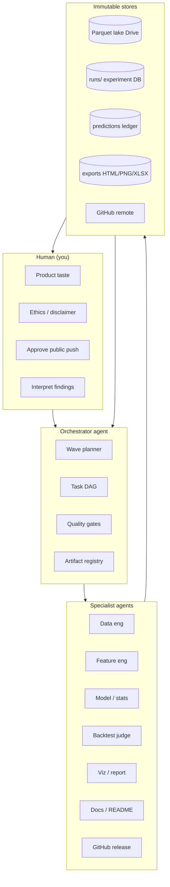
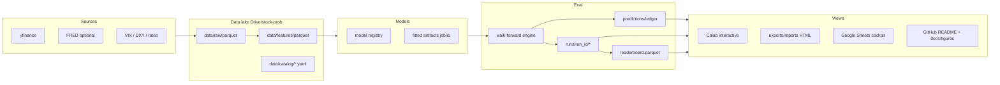
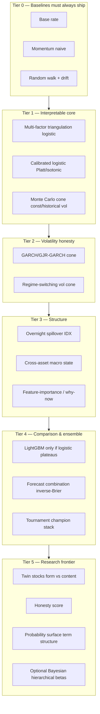
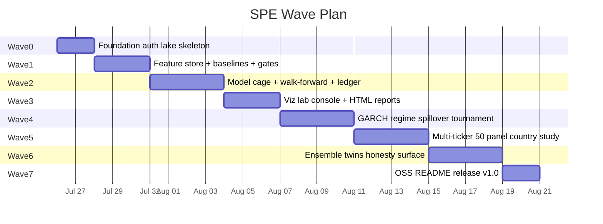
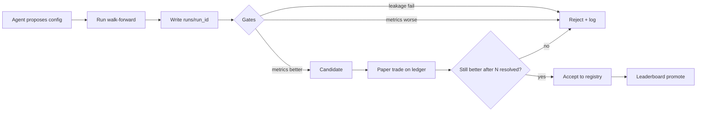
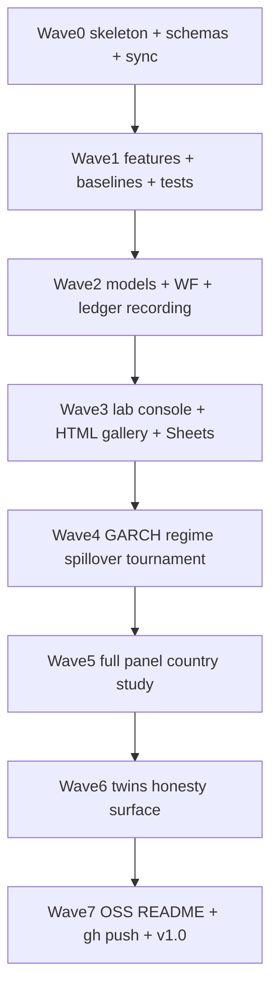

# Stock Probability Engine — Comprehensive Ambitious Plan (v2)

**Codename:** `stock-prob` → public name **Prism**  
**Vision class:** Full research *platform*, not a one-notebook MVP  
**Compute philosophy:** **AI-agent swarm + Colab CPU** — time & boilerplate are not the bottleneck; scientific honesty is  
**Persistence:** Google Drive (lab fridge) + Parquet lake + prediction/experiment ledgers + GitHub (published lab)  
**Markets:** IDX + US (comparative market-efficiency experiment built-in)

> **v2 revision note:** Plan no longer stops at MVP. MVP is only **Wave 0 bootstrap**. The committed end-state is a **viewable, auditable, continuously recording probability lab** with multi-model tournaments, full artifact lineage, and open-source scientist packaging.

---

## 0. North Star (ambitious)

### 0.1 What we are building

A **Probability Lab for equities**: every forecast is a first-class object that can be:

1. **Seen** — interactive fan charts, calibration walls, tournament boards  
2. **Checked** — resolved against reality, scored, audited for leakage  
3. **Compared** — baselines vs models vs tuned variants vs ensembles  
4. **Replayed** — full snapshot of features, params, code version, data version  
5. **Tuned** — agents propose configs; ledger is the judge (Brier / CRPS / coverage)  
6. **Published** — GitHub repo that looks like a serious open DS lab  

### 0.2 What we refuse

| Refuse | Why |
|---|---|
| Single fake price line as “prediction” | Statistically dishonest |
| Accuracy without baselines | Meaningless |
| Hand-tuned FOMO without OOS ledger | Overfitting theater |
| Deep learning as first move | Low SNR markets; explainability dies |
| “MVP then maybe later” as ceiling | This revision commits to full lab |

### 0.3 End-state success criteria (Lab v1.0 — ship target)

Not “notebook runs”. All of the following:

| # | Criterion |
|---|---|
| 1 | **Multi-horizon** cones + `P(up)` for 5d / 21d / 63d / 126d / 252d |
| 2 | **Multi-market** panel (≥20 IDX + ≥20 US) with country skill comparison |
| 3 | **Multi-model cage**: base rate, RW+drift, momentum, logistic, GARCH-cone, calibrated ensemble |
| 4 | **Experiment tracker**: every run writes immutable `run_id` artifacts |
| 5 | **Live-style ledger**: append predictions, auto-resolve, self-score (Brier, log-loss, cone CRPS/coverage) |
| 6 | **View layer**: Colab dashboard + static HTML report + Sheets cockpit + README figures |
| 7 | **Leakage firewall**: PIT features + embargo tests in CI |
| 8 | **Agent playbooks**: documented agent tasks that can re-run waves without human coding |
| 9 | **GitHub OSS package**: badges, mermaid, methodology, releases `v0.1`…`v1.0` |
| 10 | **Calibration wall** published: reliability diagrams per model × horizon × market |

---

## 1. Operating model: AI agents remove time/tech friction

Humans set **taste & constraints**. Agents execute **waves**.



### 1.1 Agent playbooks (re-runnable)

| Agent | Owns | Definition of done |
|---|---|---|
| **Data eng** | ingest, schemas, incremental cache, data quality report | zero silent NaN bombs; freshness SLA |
| **Feature eng** | PIT feature store, feature catalog YAML | leakage tests green |
| **Model smith** | model registry, hyperparams, training | writes `model_card.json` per fit |
| **Judge** | walk-forward, embargo, metrics, significance | leaderboard parquet updated |
| **Viz** | Plotly apps, HTML reports, PNG for README | gallery index.html browsable |
| **Ledger clerk** | append/resolve/tournament | no orphan predictions |
| **Docs** | README, methodology, changelog | links resolve; figures embedded |
| **Release** | git tag, gh release, Colab badge | vX.Y.Z published |

### 1.2 Parallelism strategy

- **Wave N** can fan out: features // baselines // viz shells  
- **Never parallelize** leakage-sensitive joins without PIT tests  
- Agents always write to **`runs/{run_id}/`** first; promote to `latest/` only after gates  

### 1.3 Human only when

- OAuth / Drive re-auth after runtime death  
- Making repo public / legal name on README  
- Choosing “stop research / ship narrative”  
- Anything destructive (delete Drive lake, force-push main)

---

## 2. Full system architecture



### 2.1 Dual root paths

| Root | Role |
|---|---|
| `/content/stock-prob` | Ephemeral fast workspace |
| `/content/drive/MyDrive/stock-prob` | **Source of truth** (always sync) |
| GitHub | Code + docs + *sampled* figures (not full lake) |

---

## 3. Data recording doctrine — “record everything”

**Principle:** If it influenced a number on a chart, it must be recoverable from disk without re-guessing.

### 3.1 Artifact taxonomy

```
stock-prob/
├── data/
│   ├── raw/{ticker}.parquet              # OHLCV + volume
│   ├── features/{ticker}.parquet         # PIT feature matrix
│   ├── panels/market_panel.parquet       # multi-ticker aligned
│   ├── quality/dq_{date}.json            # missingness, outliers
│   └── catalog/features.yaml             # definitions, windows, units
├── predictions/
│   ├── ledger.parquet                    # append-only master journal
│   ├── ledger_partitions/yyyy=…/         # optional hive partitions
│   └── resolves/resolve_log.parquet      # when actuals filled
├── runs/
│   └── {run_id}/
│       ├── config.yaml                   # full frozen config
│       ├── git_sha.txt                   # if repo present
│       ├── data_fingerprint.json         # hashes of input parquet
│       ├── metrics.json                  # aggregate scores
│       ├── metrics_by_slice.parquet      # ticker×horizon×model
│       ├── predictions.parquet           # run-local preds
│       ├── oof_predictions.parquet       # walk-forward preds
│       ├── calibration_bins.parquet
│       ├── cone_diagnostics.parquet
│       ├── figures/*.png
│       ├── report.html                   # self-contained view
│       └── model_cards/*.json
├── leaderboard/
│   ├── leaderboard.parquet               # rolling best configs
│   └── history.parquet                   # every run’s headline scores
├── exports/
│   ├── gallery/index.html                # browsable viz hub
│   ├── excel/{ticker}_{run_id}.xlsx
│   └── sheets_mirror_meta.json
└── registry/
    ├── models.yaml                       # model zoo
    └── experiments.yaml                  # planned + completed experiments
```

### 3.2 Prediction ledger schema (master)

Every row is one (ticker, horizon, model_version, predicted_at):

| Column group | Fields |
|---|---|
| Identity | `pred_id`, `run_id`, `predicted_at`, `ticker`, `market` (IDX/US), `horizon_days` |
| Model | `model_version`, `model_family`, `ensemble_weights` JSON |
| Forecast | `prob_up`, `prob_raw`, `prob_calibrated`, `cone_p10/p50/p90`, `cone_p05/p95` |
| Uncertainty | `cone_width`, `entropy`, `regime_label`, `confidence_class` |
| Feature snapshot | `beta_dom`, `beta_spx`, `corr_dom`, `corr_spx`, `vol`, `mom_5`, `mom_21`, `vix`, `dxy`, … |
| Data lineage | `feature_asof`, `price_asof`, `data_hash` |
| Outcome (nullable) | `actual_return`, `actual_up`, `actual_price_end`, `resolved_at` |
| Scores (nullable) | `brier`, `log_loss`, `hit`, `cone_hit_80`, `pinball_loss`, `crps_approx` |
| Human notes | `tags`, `comment` |

### 3.3 Experiment / tuning record

Every agent tuning attempt writes:

- `config.yaml` (complete, not “what we remember”)  
- `diff_from_baseline.yaml`  
- Metrics + slice metrics  
- Promote flag: `candidate` | `accepted` | `rejected` | `retired`  

**Judge is always the ledger/OOS metrics — never vibes.**

### 3.4 What “viewable & checkable” means

| Audience | View | Check action |
|---|---|---|
| You on phone | Google Sheets cockpit | See open preds + resolved Brier |
| You on Colab | Interactive Plotly dashboard | Hover cone; switch horizon/model |
| Portfolio visitor | `exports/gallery/index.html` + GitHub README | Static figures + tables |
| Future you | `runs/{run_id}/report.html` | Reproduce one experiment |
| Agent | parquet APIs | Auto-compare run_id A vs B |

---

## 4. Model zoo & scientific ladder (not just logistic)



**Rule:** Higher tier never deletes lower tier from the cage. Leaderboard always includes Tier 0.

### 4.1 Horizons (richer than 3)

| Horizon | Days | Character |
|---|---|---|
| Micro | 5 | noise + short momentum |
| Short | 21 | swing / monthly |
| Quarter | 63 | intermediate |
| Semi | 126 | fundamental starts to matter |
| Year | 252 | hard mode; needs breadth |

### 4.2 Markets & panels

| Panel | Size target | Purpose |
|---|---|---|
| Pilot | 2–4 names | Debug |
| Core | 10 IDX + 10 US | Stable leaderboard |
| Full lab | ≥25 IDX + ≥25 US | 252d sample, twins, country study |

### 4.3 Metrics wall (full)

**Probability:** Brier, log-loss, ECE / reliability, skill vs base rate  
**Cones:** coverage@50/80/90, sharpness, interval score, approx CRPS  
**Significance:** Diebold-Mariano, block bootstrap CIs  
**Honesty:** correlation(confidence, realized difficulty)  
**Ops:** data freshness, % resolved, runtime cost  

---

## 5. Visualization & UX program (ambitious)

### 5.1 Surfaces we ship

| Surface | Tech | Purpose |
|---|---|---|
| **Lab Console** | Colab + ipywidgets + Plotly | Daily research cockpit |
| **Run Report** | Self-contained HTML per `run_id` | Audit one experiment |
| **Gallery** | `exports/gallery/index.html` | Browse all figures |
| **Sheets Cockpit** | gspread | Mobile track record |
| **GitHub Story** | README + docs/figures | Public narrative |
| **Leaderboard heatmaps** | Plotly | model × horizon × market |

### 5.2 Chart inventory (required gallery)

1. Fan chart multi-band (p05–95, p10–90, p25–75, median)  
2. Horizon switch animation / tabs  
3. Calibration / reliability diagram per model  
4. Coverage vs sharpness scatter  
5. Rolling Brier skill over time  
6. Tournament strip (hit/miss + Brier paint)  
7. Feature snapshot “why now” bullets  
8. Regime-colored background on price  
9. IDX vs US skill bars  
10. Probability surface heatmap (horizon × P_up)  
11. Twin-stock cluster map (later)  
12. Data quality dashboard (missingness, stale tickers)

### 5.3 Interaction requirements

- Hover future date → tooltip: *“80% band [L,U], P(up)=…, model=…”*  
- Click resolved point → **report card** of that prediction (snapshot + outcome + score)  
- Compare mode: overlay two `run_id`s or two `model_version`s  
- Export one-click: PNG + Excel + deep-link to `run_id` folder  

### 5.4 Design language

- Deep slate / navy (not neon trader cliché)  
- Color = meaning (uncertainty opacity, not rainbow)  
- Every chart caption states **sample size + period + baseline**  

---

## 6. Wave plan (execution roadmap — full lab)

Waves replace “MVP-only”. Each wave **ships viewable artifacts** and **records data**.



> Dates are relative; agents compress calendar time. Gates matter more than calendar.

---

### Wave 0 — Foundation (bootstrap)
**Goal:** irreversible lab plumbing.

- Dual-root bootstrap (Drive truth)  
- Package skeleton `src/stock_prob/`  
- Schemas for raw/features/ledger/runs  
- Ingest incremental + DQ JSON  
- Pilot panel cached  
- Git init (local)  

**Exit gate:** re-open runtime → load lake from Drive → ingest is no-op if fresh.

---

### Wave 1 — Feature store + baseline cage
**Goal:** scientific floor exists before clever models.

- Full PIT feature builder + `features.yaml` catalog  
- Labels all horizons + embargo utilities  
- Tier-0 baselines implemented  
- Unit tests: PIT, embargo, timezone/alignment IDX-US  
- First `runs/run_id` with **baseline-only** metrics + HTML stub  

**Exit gate:** baseline leaderboard numbers frozen and reproducible from cache offline.

---

### Wave 2 — Model cage + walk-forward + master ledger
**Goal:** first real probability engine with audit trail.

- Logistic multi-horizon + calibration  
- Monte Carlo cones  
- Walk-forward expanding + monthly refit  
- Write OOF preds to ledger + run folder  
- Metrics wall v1 (Brier, calibration, coverage, sharpness)  
- Significance tests vs base rate  

**Exit gate:** for pilot tickers, full metrics table vs baselines; all preds recorded.

---

### Wave 3 — View layer (see everything)
**Goal:** humans can *see and check* without reading code.

- Lab Console notebook (ticker/horizon/model selectors)  
- Fan chart + calibration + rolling skill  
- Per-run `report.html` generator  
- Gallery index  
- Excel multi-tab export  
- Sheets mirror of open + resolved predictions  

**Exit gate:** someone non-author can open gallery/Sheets and explain last forecast.

---

### Wave 4 — Volatility, regime, spillover, tournament
**Goal:** honesty + market structure.

- GARCH/GJR cones  
- Regime labels → cone breathing + UI badge  
- IDX overnight spillover model  
- VIX vs DXY study recorded as experiment  
- Multi-model tournament + inverse-Brier ensemble  
- Auto-reject configs that fail leakage or degrade OOS  

**Exit gate:** ensemble ≥ best single model on Brier skill **or** documented failure with evidence.

---

### Wave 5 — Scale lab (breadth)
**Goal:** statistical power + comparative science.

- ≥25 IDX + ≥25 US universe (liquid names)  
- Panel feature build pipeline  
- Country × horizon skill heatmaps  
- 252d evaluation becomes meaningful  
- Data quality monitor for dead tickers  

**Exit gate:** published comparison: “skill IDX vs US” with CIs.

---

### Wave 6 — Frontier research modules
**Goal:** signature science, not me-too predictor.

- Twin stocks (form vs content clustering)  
- Honesty score  
- Probability surface term structure  
- Optional Bayesian hierarchical shrinkage on betas  
- LightGBM **only if** logistic plateaus (feature importance primary)  
- Stress era studies (COVID, 2022 rates, etc.) as fixed eval slices  

**Exit gate:** at least two “paper-like” findings written in `docs/findings/`.

---

### Wave 7 — Open-source packaging & narrative
**Goal:** external-facing lab.

- Flagship README (badges, mermaid, figures, Colab)  
- methodology.md, metrics.md, architecture.md  
- Ethics / not-advice  
- CI: unit tests + notebook smoke  
- Releases: `v0.1-wave2` … `v1.0-lab`  
- Optional Streamlit later (hosting optional; not blocking)  

**Exit gate:** cold visitor understands claims, limits, and can run demo.

---

## 7. Tuning & tournament system (agents as optimizers)



### 7.1 Search spaces agents may explore

- Rolling windows (40–120d)  
- Feature subsets (triangulation-only vs +macro vs +momentum)  
- Calibration method  
- Cone vol model (hist / EWMA / GARCH)  
- Ensemble weights  
- Regime thresholds  

### 7.2 Hard constraints on agents

- No peeking future bars  
- No optimizing on full sample without WF  
- No deleting baseline rows from board  
- Every proposal costs one `run_id` (budgeted)  

### 7.3 Comparison UX

`compare(run_a, run_b)` produces:

- ΔBrier by horizon/market  
- Calibration overlay  
- Cone coverage delta  
- Verdict card: accept / reject / inconclusive (sample size)

---

## 8. Quality gates (CI for science)

| Gate | Blocks promotion if |
|---|---|
| **PIT test** | Feature uses future data |
| **Embargo test** | Overlapping labels in train folds |
| **Baseline presence** | Model metrics without Tier-0 |
| **Coverage sanity** | 80% cone covers <60% or >95% without note |
| **Sample size** | Claims on n < threshold |
| **Artifact complete** | Missing config/fingerprint/figures |
| **Repro** | Re-run same config → metrics mismatch > tol |

---

## 9. GitHub & open-source packaging (big-lab aesthetic)

### 9.1 Repo target structure

```
stock-probability-engine/
├── README.md
├── LICENSE
├── CODE_OF_ETHICS.md
├── CONTRIBUTING.md
├── CITATION.cff
├── pyproject.toml
├── requirements.txt
├── .github/workflows/ci.yml
├── docs/
│   ├── architecture.md
│   ├── methodology.md
│   ├── metrics.md
│   ├── findings/
│   ├── COMPREHENSIVE_PLAN.md
│   └── figures/
├── src/stock_prob/
├── notebooks/
├── tests/
├── scripts/
│   ├── run_wave.py
│   ├── resolve_ledger.py
│   └── build_gallery.py
└── configs/
    ├── pilot.yaml
    ├── core_panel.yaml
    └── full_lab.yaml
```

### 9.2 README flagship outline

1. Hero + badges + one-liner  
2. **Live claims panel** (last leaderboard snapshot table)  
3. Visual gallery (fan, calibration, country skill)  
4. Mermaid system architecture  
5. Method: triangulation → probability → cone → judge  
6. Quickstart Colab  
7. Reproduce a `run_id`  
8. Model zoo & leaderboard  
9. Limitations & ethics  
10. Roadmap waves with checkboxes  
11. Citation  

### 9.3 What goes to git vs Drive only

| GitHub | Drive only |
|---|---|
| Code, configs, tests, docs | Full raw/feature lake |
| Sample fixtures (tiny) | Full multi-year panels |
| Selected figures | All runs history |
| Leaderboard snapshot CSV | Heavy prediction partitions |

---

## 10. Colab / Drive / Sheets / GitHub — ops runbook

| Event | Action |
|---|---|
| New session | Mount Drive → bootstrap → `sync_pull` |
| After any wave | `sync_push` lake + runs + gallery |
| Daily (optional) | `resolve_ledger.py` → update Sheets |
| Before push | Export figures; scrub secrets; run tests |
| Runtime death | Nothing critical lost if Drive truth held |

---

## 11. Resource map (already available)

| Resource | Status | Use |
|---|---|---|
| Colab CPU 12GB | ✅ | All compute |
| Drive | ✅ | Lake + runs |
| gspread / Google user | ✅ | Sheets cockpit |
| GitHub `SeraKah-1` | ✅ | Publish |
| yfinance | ✅ | Primary market data |
| arch / sklearn / plotly | ✅ / installable | Models + viz |
| Agent orchestrator (this session) | ✅ | Wave execution |

---

## 12. Risks (ambitious plan edition)

| Risk | Mitigation |
|---|---|
| Scope infinity | Waves + gates; ship gallery each wave |
| Agent overfit search | Strict OOS judge; budget run_ids |
| Yahoo rate limits | Cache-first; backoff; panel batching |
| 252d underpowered | Breadth panel mandatory before claims |
| Viz without science | Gate: no figure without metrics.json |
| Public misread as trading advice | Ethics doc + README banners |
| Drive quota | Parquet compression; partition; purge rejected bulky artifacts optionally |

---

## 13. Definition of Done — Lab v1.0

- [ ] Waves 0–7 complete with artifacts on Drive  
- [ ] ≥50 tickers, 5 horizons, multi-model leaderboard  
- [ ] Ledger resolving automatically with scores  
- [ ] Gallery + Sheets + Colab console all show same `run_id` truth  
- [ ] Findings docs ≥2  
- [ ] GitHub public (or private→public) with README scientist-grade  
- [ ] Release `v1.0.0` + reproducible pilot demo  
- [ ] Agent playbooks documented so a fresh agent can continue  

---

## 14. Immediate execution order (when you say go)



**Parallelism after Wave 2:** docs agent can draft methodology while viz agent builds gallery shells; judge agent keeps scoring.

---

## 15. One-paragraph contract

We are not shipping a toy stock notebook. We are building a **full probability laboratory**: every forecast recorded, every experiment comparable, every chart checkable against baselines, every wave producing viewable artifacts, with **AI agents** executing the engineering so human time goes to interpretation—not plumbing. MVP is only the on-ramp; **Lab v1.0** is the destination: multi-market, multi-horizon, multi-model, continuously scored, open-source packaged, and honest about uncertainty.

---

*Plan v2 · 2026-07-26 · Ambitious revision · Companion: ENV_READINESS.md · AUTH_STATUS.txt*
